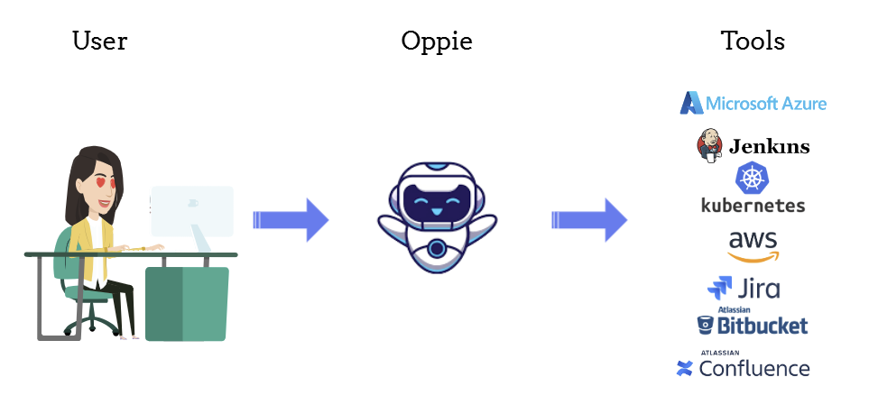

# **Oppie: The DevOps Chatbot**



## **Introduction**

**Oppie** is a chatbot designed to streamline DevOps workflows by converting user queries into actionable command-line interface (CLI) commands. With a simple web interface, users can chat with Oppie to retrieve information from their AWS accounts, such as the number of S3 buckets or the list of EC2 instances in a specific region. Oppie processes these requests, executes the necessary AWS CLI commands, and returns the results in a human-readable format.

Currently, Oppie is tailored for AWS, but future updates will expand its capabilities to include other essential DevOps tools.

## **How Oppie Works**

### **1. User Interaction**
Users engage with Oppie through a web-based chat interface. For example, you can ask:
- "How many S3 buckets are in my AWS account?"
- "List all EC2 instances in the us-east-1 region."

### **2. Command Generation**
Oppie interprets the user's query and uses Azure OpenAI to generate the appropriate AWS CLI command. The bot references a predefined set of AWS commands to ensure accuracy.

### **3. Command Execution**
Once the command is generated:
- **Execution:** Oppie runs the command using Python's `subprocess` module.
- **Error Handling:** If any issues arise during execution, such as syntax errors or permission problems, Oppie catches these errors and informs the user.

### **4. Output Formatting**
After executing the command:
- **Capture:** Oppie captures the output.
- **Human-Readable Format:** The output is converted into a user-friendly format, such as a list of resources or a summary.

### **5. Response Delivery**
Finally, Oppie sends the formatted output back to the user through the chat interface, completing the interaction.

## **Features**

- **AWS Integration:** Directly interact with your AWS account through natural language queries.
- **Accurate Command Generation:** Uses a predefined command set for precise AWS CLI command generation.
- **Human-Readable Output:** Converts raw CLI output into easy-to-understand information.
- **Expandable:** Designed with scalability in mind, allowing future integration with other DevOps tools.

## **Future Plans**

Oppie will soon support additional DevOps tools beyond AWS, making it a versatile assistant for managing infrastructure, CI/CD pipelines, monitoring systems, and more.

## **Setup and Installation**

### **Prerequisites**

- Python 3.7+
- Flask
- Azure OpenAI SDK
- AWS CLI
- Other dependencies listed in `requirements.txt`

### **Installation**

1. **Clone the repository:**
   ```bash
   git clone https://github.com/your-repo/oppie-devops-chatbot.git
   cd oppie-devops-chatbot
   ```

2. **Install the required dependencies:**
   ```bash
   pip install -r requirements.txt
   ```

3. **Set up your Azure OpenAI credentials:**
   Update the `client = AzureOpenAI()` part of `app.py` with your Azure OpenAI API key and endpoint.

4. **Run the Flask app:**
   ```bash
   python app.py
   ```

5. **Access Oppie in your browser:**
   Navigate to `http://127.0.0.1:5000` to start chatting with Oppie.

## **Contributing**

Contributions to Oppie are welcome. Whether you’re adding new command sets, integrating more DevOps tools, or enhancing the UI, your help is appreciated.


## **Acknowledgments**

- Flask
- Azure OpenAI
- AWS CLI

